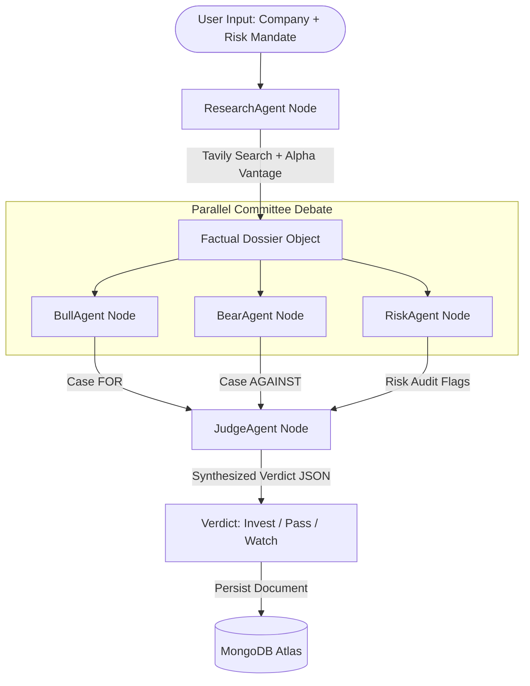

# Equilibrium — AI Investment Committee Debate

Equilibrium is an AI Investment Research Agent that simulates a multi-agent investment committee debate to decide `Invest`, `Pass`, or `Watch` on a given target company. The system runs an asynchronous, parallel state-graph using **LangGraph.js** to evaluate the stock.

## Architecture Overview

Equilibrium uses a 5-node LangGraph.js state graph configuration to enforce objective debate synthesis. By decoupling positive, negative, and risk considerations, the system ensures that the final verdict is calculated without observation biases.



### Graph Node Functions:
1. **ResearchAgent:** Resolves stock ticker via LLM lookup. Executes parallel Tavily REST news search and Alpha Vantage fundamentals retrieval. Compiles a facts-only, opinions-free dossier.
2. **BullAgent:** Receives the dossier and writes the strongest possible investment case **FOR** the company.
3. **BearAgent:** Receives the dossier in parallel and writes the strongest investment case **AGAINST** the company. (Runs independently of the BullAgent to prevent cross-bias).
4. **RiskAgent:** Evaluates the dossier to extract audited hazard tags (leverage, valuation peaks, regulatory hurdles).
5. **JudgeAgent:** Synthesizes the Bull thesis, Bear risks, and hazard tags relative to the user's selected Risk Mandate (Conservative, Balanced, or Aggressive) to decide the final verdict.

---

## Environment Variables Configuration

Create a `.env` file in the `backend/` directory based on the following parameters:

| Variable | Description | Required | Example |
| :--- | :--- | :--- | :--- |
| `PORT` | Local port for Express API | No (Defaults to 5000) | `5000` |
| `MONGODB_URI` | Connection string for MongoDB database | Yes | `mongodb://localhost:27017/equilibrium` |
| `GROQ_API_KEY` | Groq Developer API portal key | Yes | `gsk_XyZ...` |
| `TAVILY_API_KEY` | Tavily Web Search API key | Yes | `tvly-...` |
| `ALPHA_VANTAGE_API_KEY`| Alpha Vantage financial fundamentals API key | No (Optional) | `demo` |

---

## Project Setup

Ensure you have [Node.js](https://nodejs.org/) installed (v18+ recommended).

### 1. Installation

From the project root directory, install dependencies for both the backend and frontend:

**Backend Setup:**
```bash
cd backend
npm install --legacy-peer-deps
```

**Frontend Setup:**
```bash
cd ../frontend
npm install --legacy-peer-deps
```

### 2. Development Execution

You can run both servers concurrently:

**Start Backend Server:**
```bash
cd backend
npm run dev
```
_The API will listen at `http://localhost:5000` (uses nodemon for hot-reloads)._

**Start Frontend Client:**
```bash
cd frontend
npm run dev
```
_The client will boot the Vite dev server, typically at `http://localhost:5173`._

---

## API Endpoints

- `POST /api/research`
  - Body: `{ "companyName": "NVIDIA", "riskProfile": "Balanced" }`
  - Action: Runs the full debate graph and saves the result to MongoDB.
- `GET /api/sessions`
  - Action: Lists all historical debate sessions.
- `GET /api/sessions/:id`
  - Action: Retrieves a specific session's full debate case data.
